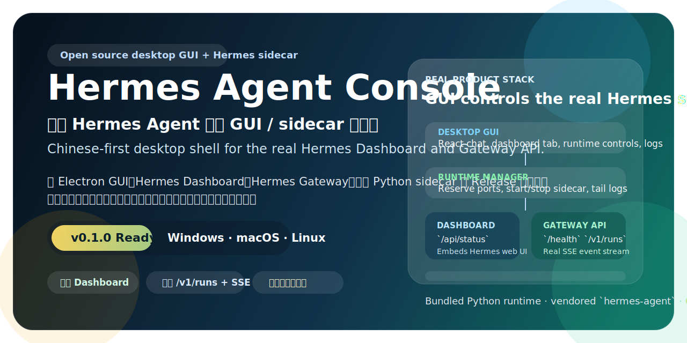
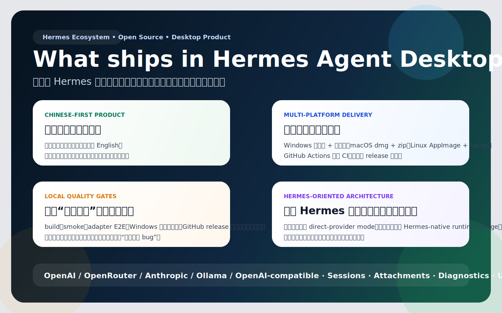
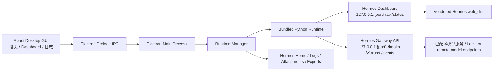
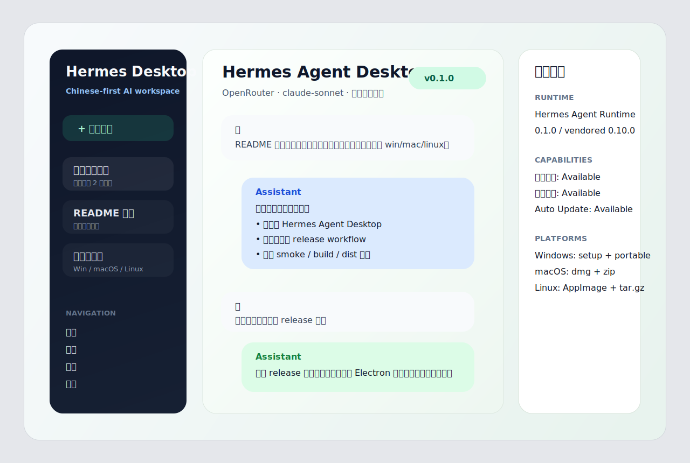

<p align="center">
  
</p>

<h1 align="center">Hermes Agent Console</h1>

<p align="center">
  真实 Hermes Agent 桌面 GUI / sidecar 控制台。<br/>
  <em>Chinese-first desktop GUI and sidecar console for the real Hermes Agent.</em>
</p>

<p align="center">
  这个仓库把 <code>vendor/hermes-agent</code> 中的真实 Hermes Dashboard、Gateway API 与本地 Python 运行时封装进 Electron 桌面壳，
  再配上中文优先的 React 控制台、日志面板、运行时启停、安装包与 GitHub Releases 交付链路。
</p>

<p align="center">
  <a href="https://github.com/laolaoshiren/hermes-agent-desktop/releases"></a>
  <a href="https://github.com/laolaoshiren/hermes-agent-desktop/actions/workflows/ci.yml"></a>
  
  
  <a href="./LICENSE"></a>
</p>

## 产品概览

<p align="center">
  
</p>

`Hermes Agent Console` 不是一个“演示壳”或者“伪装成桌面版的网页入口”，而是一个可安装、可运行、可验证、可发布的真实 Hermes Agent 桌面产品层。

- 中文优先，英文辅助；默认界面为简体中文，界面内可切换到 English。
- Electron 主进程负责托管 sidecar 生命周期，React 前端负责聊天、状态和日志控制台。
- Hermes Dashboard 与 Gateway API 来自仓库内 vendored upstream，并由本地 Python sidecar 真正启动。
- 对话链路走真实 `/v1/runs` 与 SSE 事件流，不是占位数据。
- 支持本地会话、运行时日志、Hermes Home 打开、诊断与安装包交付。

## 当前交付

| 模块 | 真实内容 | English |
| --- | --- | --- |
| 桌面 GUI | 聊天页、Dashboard 页、TUI / CLI 控制桥、运行时状态卡片、日志面板、启停按钮、语言切换 | Chat, dashboard, CLI/TUI bridge, runtime controls, logs, locale toggle |
| Hermes sidecar | 本地 Python 启动 `dashboard` 与 `gateway run`，暴露 `/api/status`、`/health`、`/v1/runs`、SSE | Local Python sidecar exposes dashboard, health, runs, and SSE |
| 数据目录 | `Hermes Home`、日志目录、附件目录、导出目录、更新目录 | Hermes home, logs, attachments, exports, updates |
| 兼容后端 | 可对接 OpenAI、OpenRouter、Anthropic、Ollama 以及兼容 OpenAI 协议的服务 | Works with OpenAI, OpenRouter, Anthropic, Ollama, and OpenAI-compatible services |
| 交付形式 | Windows `setup.exe`/`portable.exe`，macOS `dmg`/`zip`，Linux `AppImage`/`tar.gz` | Installers and archives for Windows, macOS, and Linux |

## 真实架构



这一层次对应当前代码里的真实职责：

- `apps/desktop/frontend`：桌面 GUI，读取运行时快照，发送任务到 Hermes Gateway，接收 SSE 事件。
- `apps/desktop/electron`：Electron 主进程与 preload，负责窗口、IPC、目录打开、sidecar 启停。
- `packages/runtime-manager`：解析 bundled Python、预留端口、启动 Hermes Dashboard 与 Gateway、维护状态与日志。
- `vendor/hermes-agent`：上游 Hermes 运行时与 Web 资产来源。
- `runtime/python`：打包或引导得到的本地 Python 运行时。

仓库并不重写 Hermes runtime，而是把真实 Hermes sidecar 放进桌面产品边界内，让 GUI、日志、打包与发布流程完整可用。

## 界面预览

<p align="center">
  
</p>

界面设计围绕两个核心场景展开：

- `Chat`：把任务发送到真实 Hermes Agent，展示流式输出、工具事件、终态结果。
- `Dashboard`：直接内嵌 Hermes 原生 Dashboard，保留上游能力与可观测性。
- `TUI / CLI`：从桌面 GUI 直接拉起真实 `hermes model`、`hermes tools`、`hermes auth`、`hermes profile`、`hermes gateway setup` 与 `hermes chat --tui`。

## 安装与运行

### 从 Releases 安装

前往 [GitHub Releases](https://github.com/laolaoshiren/hermes-agent-desktop/releases) 下载对应平台产物：

| 平台 | 建议产物 | 说明 |
| --- | --- | --- |
| Windows | `setup.exe` | 标准安装版 |
| Windows | `portable.exe` | 免安装便携版 |
| macOS | `dmg` / `zip` | 由 GitHub Actions 在 macOS runner 构建 |
| Linux | `AppImage` / `tar.gz` | 由 GitHub Actions 在 Ubuntu runner 构建 |

### 从源码运行

环境要求：

- Node.js 24+
- npm 11+
- macOS / Linux 开发环境需要可用的 `python3.11`，用于初始化 `runtime/python`

命令：

```bash
npm ci
npm run build
npm run start
```

`npm run build` 会做三件事：

1. 准备 Hermes Python sidecar 依赖。
2. 构建 vendored Hermes Web 资源。
3. 编译 shared、runtime-manager、前端与 Electron 主进程。

## 测试

这个仓库的测试目标不是“页面能打开”，而是“真实 Hermes sidecar 能被桌面产品正确托管与交付”。

```bash
npm run build
npm run smoke
npm run test:e2e
npm run test:local
npm run test:package:win
npm run test:github
```

| 命令 | 目的 |
| --- | --- |
| `npm run build` | 准备 sidecar 依赖、Hermes Web 资源，并完成全部桌面构建 |
| `npm run smoke` | 启动 Hermes Dashboard + Gateway，检查 `/api/status` 与 `/health` |
| `npm run test:e2e` | 调用真实 `/v1/runs`，订阅 SSE，确认能收到终态事件 |
| `npm run test:local` | 串联本地构建、smoke、端到端验证 |
| `npm run test:package:win` | 验证 Windows 安装包、便携版、`app.asar` 与打包后的 sidecar 资源 |
| `npm run test:github` | 验证仓库、工作流、Release 资产与 README 媒体引用 |

详细说明见 [docs/TESTING.md](./docs/TESTING.md)。

## 发布

### 本地打包

```bash
npm run dist:win
npm run dist:mac
npm run dist:linux
```

默认输出目录：

```text
release/
```

### GitHub Release 流程

当推送 `v*` tag 时，`.github/workflows/release.yml` 会自动执行：

1. `npm ci`
2. `npm run build`
3. `npm run smoke`
4. `npm run test:e2e`
5. `electron-builder` 多平台打包
6. Windows 安装包二次校验
7. 上传 Release 资产

当前版本发布记录见 [docs/releases/v0.1.0.md](./docs/releases/v0.1.0.md)。

## 与上游 Hermes 的关系

- 上游项目：[`NousResearch/hermes-agent`](https://github.com/NousResearch/hermes-agent)
- 本仓库交付的是桌面 GUI、sidecar 生命周期管理、安装包与开源发布链路。
- 上游 Hermes 仍然是核心运行时来源；仓库通过 vendored 方式引入并打包其 Dashboard、Gateway 与 Web 资产。

## 仓库结构

```text
apps/desktop/frontend        React 桌面 GUI
apps/desktop/electron        Electron main / preload
packages/runtime-manager     Hermes sidecar 生命周期与状态管理
packages/shared              品牌、契约与共享类型
runtime/python               本地 Python 运行时
vendor/hermes-agent          Vendored upstream Hermes
docs/                        文档、发布说明与媒体素材
```

## 开源说明

- 许可证：[MIT](./LICENSE)
- 第三方说明：[THIRD_PARTY_NOTICES.md](./THIRD_PARTY_NOTICES.md)
