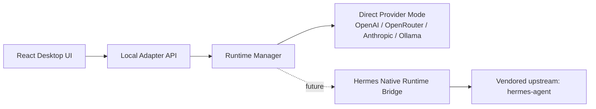

<p align="center">
  
</p>

<h1 align="center">Hermes Agent Desktop</h1>

<p align="center">
  中文优先、英文可切换的开源桌面 AI 工作台。<br/>
  Productized for the <code>hermes-agent</code> ecosystem, but delivered as a desktop app normal users can actually install and use.
</p>

<p align="center">
  <a href="https://github.com/laolaoshiren/hermes-agent-desktop/releases"></a>
  <a href="https://github.com/laolaoshiren/hermes-agent-desktop/actions/workflows/ci.yml"></a>
  
  
  <a href="./LICENSE"></a>
</p>

## 产品定位

<p align="center">
  
</p>

`NousResearch/hermes-agent` 更偏 runtime、CLI、web、ACP 和 agent 基础设施。  
`Hermes Agent Desktop` 的目标不是复刻 upstream，而是把它收束成一个可下载、可安装、可配置、可发布的桌面产品层：

- 中文界面优先，英文为辅，设置中可切换语言
- 保留 Hermes 导向的架构边界，方便后续接入更深的原生 runtime bridge
- 先把真实可用的桌面体验做完整，再逐步把更重的 runtime 能力接进来
- 以 GitHub 开源仓库、Actions 和 Releases 作为交付中心

## 界面预览

<p align="center">
  
</p>

## 当前版本能力

### 桌面产品层

- 中文默认 UI，设置内可切换到 English
- onboarding、聊天、能力开关、设置、状态页全部可用
- 本地会话持久化
- 附件准备、提交、删除
- 诊断包导出、数据目录打开、日志目录打开
- 更新状态检查、下载、安装占位流和自动更新开关

### 模型接入层

- 真实流式响应，不是占位假聊天
- 已支持：
  - OpenAI
  - OpenRouter
  - Anthropic
  - Ollama
  - OpenAI-compatible endpoints
  - Custom OpenAI-compatible endpoints
- 支持文本附件内联与图片附件透传

### 开源与交付层

- GitHub 开源仓库
- GitHub Actions CI
- tag 驱动的多平台 release workflow
- Windows 安装版和便携版
- macOS `dmg + zip`
- Linux `AppImage + tar.gz`

## 质量验证

这个仓库现在不再只是“能跑起来”，而是有明确的本地和 GitHub 验证入口：

```bash
npm run build
npm run smoke
npm run test:e2e
npm run test:local
npm run test:package:win
npm run test:github
```

覆盖范围：

- `build`: 全部 workspace 编译
- `smoke`: mock provider 下的真实流式对话烟测
- `test:e2e`: 适配层全链路功能测试
- `test:package:win`: Windows 安装包和便携版打包、安装、启动验证
- `test:github`: 仓库、workflow、release 和资产完整性验证

详细说明见 [docs/TESTING.md](./docs/TESTING.md)。

## 发布矩阵

| 平台 | 产物 | 说明 |
| --- | --- | --- |
| Windows | `setup.exe` + `portable.exe` | 安装版和免安装便携版 |
| macOS | `dmg` + `zip` | 由 GitHub Actions 在 macOS runner 构建 |
| Linux | `AppImage` + `tar.gz` | 由 GitHub Actions 在 Ubuntu runner 构建 |

## 为什么不是直接用 upstream

- upstream 更像能力底座，不是普通中文用户直接下载安装的桌面产品
- 这个项目把“产品壳层”和“runtime 边界”拆开，避免 UI 直接耦合 upstream
- 当前 `v0.1.x` 先把 direct-provider mode 做稳，再继续推进 Hermes-native runtime bridge

## 架构概览



### 分层原则

- UI 不直接耦合 Hermes upstream，产品层可以独立演进
- Adapter 负责设置、会话、附件、诊断、更新状态和 SSE 流式桥接
- Runtime Manager 负责路径、能力探测、状态边界
- `vendor/hermes-agent` 用作上游镜像，便于后续 bridge 和 diff

## 快速开始

### 1. 从 Release 下载

进入 [Releases](https://github.com/laolaoshiren/hermes-agent-desktop/releases) 页面，根据你的系统下载对应安装包。

### 2. 本地源码运行

要求：

- Node.js 24+
- npm 11+

命令：

```bash
npm install
npm run build
npm run start
```

### 3. 本地打包

```bash
npm run dist:win
npm run dist:mac
npm run dist:linux
```

默认输出目录：

```text
release/
```

## 与 Hermes upstream 的关系

- Upstream: [NousResearch/hermes-agent](https://github.com/NousResearch/hermes-agent)
- 当前桌面版已经采用 Hermes 导向的分层设计
- 当前 `v0.1.x` 的主执行路径仍然是 direct-provider mode
- 更深的 Hermes-native runtime bridge 仍然是后续重点，但不会在发布层面伪装成“已经完全打通”

## 路线图

- [x] 中文优先桌面外壳
- [x] 真实流式模型调用
- [x] GitHub 开源仓库与多平台 Release
- [x] 本地 build / smoke / e2e / Windows package verify
- [ ] Hermes-native runtime bridge
- [ ] 更完善的自动更新机制
- [ ] 更深的工具执行与权限边界设计
- [ ] 更完整的安装演示和产品官网素材

## 第三方与许可证

- 项目许可证：[MIT](./LICENSE)
- 第三方说明：[THIRD_PARTY_NOTICES.md](./THIRD_PARTY_NOTICES.md)
