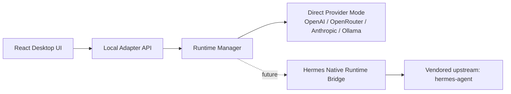

<p align="center">
  
</p>

<h1 align="center">Hermes Agent Desktop</h1>

<p align="center">
  中文优先、英文可切换的开源桌面 AI 工作台。<br/>
  Built for the <code>hermes-agent</code> ecosystem, but delivered as a polished desktop product layer.
</p>

<p align="center">
  <a href="https://github.com/laolaoshiren/hermes-agent-desktop/releases"></a>
  <a href="https://github.com/laolaoshiren/hermes-agent-desktop/actions/workflows/ci.yml"></a>
  
  
  <a href="./LICENSE"></a>
</p>

## 为什么做这个项目

`NousResearch/hermes-agent` 很强，但它本身更偏 runtime、CLI、ACP、web 和 agent 基础设施。  
`Hermes Agent Desktop` 的目标不是重复造轮子，而是把它收束成一个更适合普通中文用户直接使用、直接下载、直接发布的桌面产品：

- 中文界面优先，英文为辅
- 以 GitHub 开源仓库和 Release 为交付中心
- 保留 Hermes 架构边界，方便后续继续往原生 Hermes runtime 集成
- 先把“能装、能聊、能配置、能发布”做好，再把高级 runtime 能力逐步接进来

## 界面预览

<p align="center">
  
</p>

## 当前版本能做什么

### 产品能力

- 中文默认 UI，设置内可切换到 English
- 桌面端 onboarding、聊天、能力开关、设置、状态页
- 本地会话持久化
- 附件准备、提交、删除
- 诊断包导出与日志目录快速打开

### 模型能力

- 真实流式响应，不是占位假聊天
- 已支持：
  - OpenAI
  - OpenRouter
  - Anthropic
  - Ollama
  - OpenAI-compatible endpoints
  - Custom OpenAI-compatible endpoints

### 开源与发布能力

- GitHub 开源仓库
- GitHub Actions CI
- tag 驱动的多平台 release workflow
- 本地可构建 Windows 安装包与便携版

## 发布矩阵

| 平台 | 产物 | 说明 |
| --- | --- | --- |
| Windows | `setup.exe` + `portable.exe` | 安装版和免安装便携版 |
| macOS | `dmg` + `zip` | 通过 GitHub Actions 在 macOS runner 构建 |
| Linux | `AppImage` + `tar.gz` | 通过 GitHub Actions 在 Ubuntu runner 构建 |

## 架构概览



### 为什么这样分层

- UI 不直接耦合 Hermes upstream，方便产品层独立演进
- Adapter 负责会话、设置、附件、健康检查、诊断导出
- Runtime Manager 保留未来接入 Hermes 原生 runtime 的边界
- `vendor/hermes-agent` 作为上游源码镜像，方便后续 bridge 与 diff

## 快速开始

### 1. 从 Release 下载

进入 [Releases](https://github.com/laolaoshiren/hermes-agent-desktop/releases) 页面，根据你的系统下载对应安装包。

### 2. 本地源码运行

要求：

- Node.js 24+
- npm 11+

命令：

```bash
npm install
npm run build
npm run start
```

## 本地测试

当前仓库已经有可执行的本地验证，不是只靠肉眼看页面：

```bash
npm run build
npm run smoke
npm run test:local
```

说明：

- `npm run build`
  编译 shared、runtime-manager、adapter、frontend、electron 全部工作区
- `npm run smoke`
  启动一个本地 mock OpenAI-compatible provider，验证适配层能否真实流式返回消息
- `npm run test:local`
  串联执行 build + smoke，适合作为最小本地验收

## 本地打包

```bash
npm run dist:win
npm run dist:mac
npm run dist:linux
```

默认输出目录：

```text
release/
```

## 与 Hermes upstream 的关系

- Upstream: [NousResearch/hermes-agent](https://github.com/NousResearch/hermes-agent)
- 当前桌面版已经采用 Hermes 导向的分层设计
- 当前 `v0.1.x` 主执行路径是 direct-provider mode
- 更深的 Hermes-native bridge 仍然是后续重点，但不会在发布层面伪装成“已经完全打通”

## 当前版本的边界

`v0.1.x` 目前主打“桌面产品完整度”，不是“把 Hermes 全部能力一次性端上桌面”。

这意味着：

- 现在能稳定做的是桌面体验、会话、配置、发布、安装包、流式对话
- 正在继续推进的是原生 Hermes runtime bridge、更多工具能力、更多平台细节
- Windows 上的 Hermes 深度集成仍受上游 Python / WSL 现实约束影响

## 路线图

- [x] 中文优先桌面外壳
- [x] 真实流式模型调用
- [x] GitHub 开源仓库与 Release
- [x] Windows 本地安装包产出
- [x] GitHub Actions 多平台打包工作流
- [ ] 补齐 macOS / Linux release 产物上传
- [ ] Hermes-native runtime bridge
- [ ] 更完善的更新系统与自动发布说明
- [ ] 更完整的截图和安装演示素材

## 第三方与许可证

- 项目许可证：[MIT](./LICENSE)
- 第三方说明：[THIRD_PARTY_NOTICES.md](./THIRD_PARTY_NOTICES.md)
